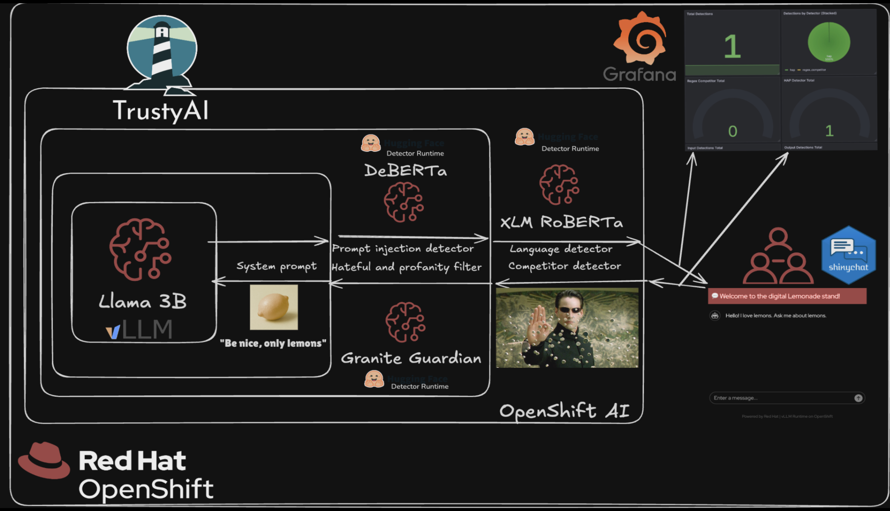

# Lemonade Stand Assistant

## Acknowledgement

This quickstart is based on the demo by Trusty AI team. It can be found [here](https://github.com/trustyai-explainability/trustyai-llm-demo/tree/lemonade-stand). If you like this demo, we encourage people to contribute to the community of TrustyAI.

## Overview

Imagine we run a successful lemonade stand and want to deploy a customer service agent so our customers can learn more about our products. We'll want to make sure all conversations with the agent are family friendly, and that it does not promote our rival fruit juice vendors.

This demo showcases how to deploy an AI-powered customer service assistant with multiple guardrails to ensure safe, compliant, and on-brand interactions. The solution uses Llama 3.2 as the base language model, protected by three detector models that monitor for harmful content, prompt injection attacks, and language compliance.

**In this demo, we are following these assumptions of principles:** 

1. The LLM is untrusted. All its output must be validated. 
2. The user is untrusted. All the input must be validated.
3. Triggering of specific detectors are monitored and visualized. (Alerts are out of scope but could be done)


**Schema slide**


## Detailed description

The Lemonade Stand Assistant provides an interactive customer service experience for a fictional lemonade stand business. Customers can ask questions about products, ingredients, pricing, and more through a conversational interface.

To ensure safe and appropriate interactions, the system employs multiple AI guardrails:
- **IBM HAP Detector (Granite Guardian)**: Monitors conversations for hate, abuse, and profanity
- **Prompt Injection Detector (DeBERTa v3)**: Identifies and blocks attempts to manipulate the AI assistant
- **Language Detector (XLM-RoBERTa)**: Ensures inputs and responses are in English only

Furthemore, there is a:
- **Regex Detector**: Blocks specific text without the use of models. In our case, its other fruits we consider "competitors".

The guardrails orchestrator coordinates these detectors to evaluate inputs and outputs before presenting responses to users.

### See it in action

TODO: an arcade will be added

#### Monitoring Dashboard

The solution includes a Grafana dashboard for monitoring guardrail detections in real-time:


> **Optional**: To deploy the monitoring dashboard, see the [grafana](./grafana) folder for installation instructions. Note that deploying Grafana may require elevated cluster privileges to install the Grafana Operator.

## Requirements

### Minimum hardware requirements

**Llama 3.2 3B Instruct (Main LLM):**
- CPU: 1 vCPU (request) / 4 vCPU (limit)
- Memory: 8 GiB (request) / 20 GiB (limit)
- GPU: 1 NVIDIA GPU (e.g., A10, A100, L40S, T4, or similar)

**IBM HAP Detector (Granite Guardian HAP 125M):**
- CPU: 1 vCPU (request) / 2 vCPU (limit)
- Memory: 4 GiB (request) / 8 GiB (limit)

**Prompt Injection Detector (DeBERTa v3 Base):**
- CPU: 4 vCPU (request) / 8 vCPU (limit)
- Memory: 16 GiB (request) / 24 GiB (limit)

**Language Detector (XLM-RoBERTa Base):**
- CPU: 4 vCPU (request) / 8 vCPU (limit)
- Memory: 16 GiB (request) / 24 GiB (limit)

**Total Resource Requirements:**
- CPU: 10 vCPU (request) / 22 vCPU (limit)
- Memory: 44 GiB (request) / 72 GiB (limit)
- GPU: 1 NVIDIA GPU (for LLM only)

> **Note**: The detector models are configured to run on CPU by default. If you have additional GPU resources available and want to improve detector performance, you can enable GPU acceleration for the detectors. See the [Configuration Options](#configuration-options) section for details on customizing GPU usage.

### Minimum software requirements

- Red Hat OpenShift Container Platform
- Red Hat OpenShift AI

### Required user permissions

Standard user. No elevated cluster permissions required.

## Deploy

### Prerequisites

Before deploying, ensure you have:
- Access to a Red Hat OpenShift cluster with OpenShift AI installed
- `oc` CLI tool installed and configured
- `helm` CLI tool installed
- Sufficient GPU resources available in your cluster

### Installation

1. Clone the repository:
```bash
git clone https://github.com/rh-ai-quickstart/lemonade-stand-assistant.git
cd lemonade-stand-assistant
```

2. Create a new OpenShift project:
```bash
PROJECT="lemonade-stand-assistant"
oc new-project ${PROJECT}
```

3. Install using Helm:
```bash
helm install lemonade-stand-assistant ./chart --namespace ${PROJECT}
```

### Configuration Options

The deployment can be customized through the `values.yaml` file. Each detector can be configured to run on GPU or CPU depending on your available resources.

#### GPU Configuration

By default, only the LLM uses GPU acceleration. All detector models run on CPU.

Each detector supports the following configuration options:

- `useGpu`: Enable GPU acceleration for the detector (default: `false`)
- `resources`: CPU and memory resource requests and limits

**Example: Enable GPU for HAP detector (requires additional GPU)**
```bash
helm install lemonade-stand-assistant ./chart --namespace ${PROJECT} \
  --set detectors.hap.useGpu=true
```

**Example: Enable GPU for all detectors (requires 4 total GPUs)**
```bash
helm install lemonade-stand-assistant ./chart --namespace ${PROJECT} \
  --set detectors.hap.useGpu=true \
  --set detectors.promptInjection.useGpu=true \
  --set detectors.language.useGpu=true
```

**Example: Custom resource allocation for HAP detector**
```bash
helm install lemonade-stand-assistant ./chart --namespace ${PROJECT} \
  --set detectors.hap.resources.requests.memory=2Gi \
  --set detectors.hap.resources.limits.memory=4Gi
```

### Validating the deployment

Once deployed, access the Lemonade Stand Assistant UI. You can find the route with:

```bash
echo https://$(oc get route/lemonade-stand-assistant -n ${PROJECT} --template='{{.spec.host}}')
```

Open the URL in your browser and start asking questions about lemonade and other fruits!

### Uninstall

To remove the deployment:

```bash
helm uninstall lemonade-stand-assistant --namespace ${PROJECT}
```

## Technical details

### Architecture

The Lemonade Stand Assistant consists of the following components:

**Inference Services:**
- **Llama 3.2 3B Instruct**: Main language model for generating responses
- **IBM HAP Detector (Granite Guardian HAP 125M)**: Detects hate, abuse, and profanity
- **Prompt Injection Detector (DeBERTa v3 Base)**: Identifies prompt injection attempts
- **Language Detector (XLM-RoBERTa Base)**: Validates language compliance (English only)

**Orchestration:**
- **Guardrails Orchestrator**: Coordinates detector models using FMS Orchestr8
- **Shiny Application**: Provides the user interface for customer interactions

### Models

| Component | Model | Size | Purpose |
|-----------|-------|------|---------|
| Main LLM | Llama 3.2 3B Instruct | 3B parameters | Conversational AI |
| HAP Detection | Granite Guardian HAP | 125M parameters | Content safety |
| Prompt Injection Guard | DeBERTa v3 Base | ~184M parameters | Security |
| Language Detection | XLM-RoBERTa Base | ~270M parameters | Language validation |



### Deployment Configuration

All models are deployed as KServe InferenceServices on OpenShift AI using:
- vLLM runtime for the main LLM (optimized inference)
- Guardrails Detector runtime for all detector models

## Tags

**Title:** Lemonade Stand Assistant

**Description:** AI-powered customer service assistant with guardrails for safe, compliant interactions using an LLM and multiple detector models.

**Industry:** Retail (but it can be applied any industry)

**Product:** OpenShift AI, Trusty AI Guardrails Orchestrator feature

**Use case:** AI safety, content moderation

**Contributor org:** Red Hat


